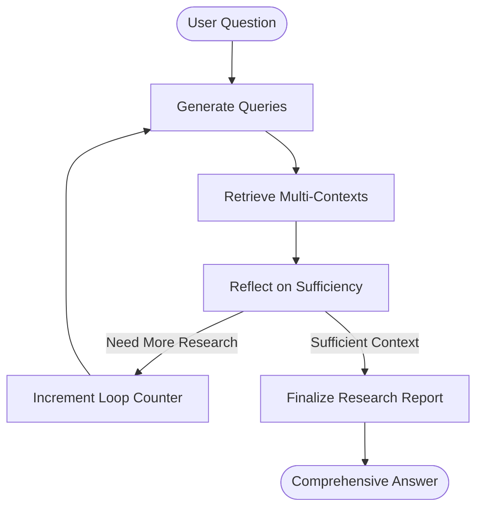

# DeepResearch Feature Implementation Guide

## 📋 Overview

This document describes the **DeepResearch** feature implementation for Scenario 2 of the RAG Knowledge Base project. DeepResearch provides multi-round retrieval and reasoning capabilities, going beyond simple question-answering to generate comprehensive research reports.

## ✨ Features Implemented

### Core Requirements ✅
- ✅ **Multi-round retrieval and reasoning** - Not simple one-shot Q&A
- ✅ **Structured research report output** - Comprehensive synthesis of findings
- ✅ **Real-time streaming output** - Progressive updates during research
- ✅ **Step display** - Shows current step (Generating Queries, Retrieving, Reflecting, Finalizing)

### Bonus Features ✅
- ✅ **Citation source and traceability** - Numeric citations [1], [2], [3] with source URLs
- ✅ **Different workflow modes** - Toggle between GPT, RAG, and DeepResearch
- ✅ **Activity timeline** - Visual display of research progress

## 🏗️ Architecture

### Backend: LangGraph Workflow



### Workflow Nodes

1. **generate_queries** - Break down user question into specific search queries
   - Generates 3 queries on first iteration, 2 on subsequent iterations
   - Avoids duplicating previous queries
   - Uses LLM to create diverse, focused queries

2. **retrieve_contexts** - Retrieve knowledge base contexts for each query
   - Queries CNB knowledge base API
   - 5 results per query
   - Aggregates and deduplicates sources
   - Tracks query attribution for each context

3. **reflect** - Analyze if gathered information is sufficient
   - Evaluates context completeness
   - Calculates confidence score (0-1)
   - Decides: continue research OR finalize report
   - Conservative approach - only marks sufficient when truly ready

4. **finalize_report** - Generate comprehensive research report
   - Synthesizes all gathered contexts
   - Uses numeric citations [1], [2], [3]
   - Structured markdown output
   - Includes all unique sources

### State Management

```python
class AgentState(TypedDict):
    # Core fields
    messages: Annotated[list, add_messages]
    repository: NotRequired[str]
    rag_enabled: NotRequired[bool]
    sources: NotRequired[List[Dict]]

    # DeepResearch fields
    research_queries: NotRequired[List[str]]
    all_contexts: NotRequired[List[Dict]]
    research_loop_count: NotRequired[int]
    max_research_loops: NotRequired[int]
    reflection_result: NotRequired[Dict]
    step_status: NotRequired[str]
    deep_research_mode: NotRequired[bool]
```

### Configuration

```python
max_research_loops: int = 3  # Maximum iterations
queries_per_iteration: int = 3  # Queries to generate
ollama_model: str = "qwen3:8b"  # LLM model
```

## 🎨 Frontend Implementation

### Mode Selection

Three modes available:
- **💬 GPT** - Direct LLM without retrieval
- **📚 RAG** - Single retrieval + answer
- **🔬 DeepResearch** - Multi-round research workflow

### Real-time Event Display

The frontend captures and displays workflow events:

```typescript
// DeepResearch events
if (event.generate_queries) {
  processedEvent = {
    title: "🔍 Generating Search Queries",
    data: queries.join(" • ")
  };
} else if (event.retrieve_contexts) {
  processedEvent = {
    title: `📚 Retrieving Knowledge (Round ${loopNum + 1})`,
    data: `Gathered ${numContexts} contexts`
  };
} else if (event.reflect) {
  processedEvent = {
    title: "🤔 Analyzing Research Progress",
    data: sufficient ? "✅ Sufficient" : "🔄 Need more research"
  };
} else if (event.finalize_report) {
  processedEvent = {
    title: "📝 Generating Research Report",
    data: "Synthesizing findings..."
  };
}
```

### Citation Rendering

Citations are clickable and link to source documents:
- Numeric format: [1], [2], [3]
- Hover to see source title
- Click to open source URL
- Source metadata displayed at bottom

## 📁 File Structure

```
backend/src/agent/
├── deep_research_graph.py     # NEW: DeepResearch workflow
├── graph.py                    # MODIFIED: Routing logic
├── state.py                    # MODIFIED: DeepResearch state fields
├── prompts.py                  # MODIFIED: DeepResearch prompts
├── configuration.py            # MODIFIED: DeepResearch config
├── cnb_retrieval.py           # Existing: CNB API calls
└── cnb_utils.py               # Existing: CNB utilities

frontend/src/
├── App.tsx                     # MODIFIED: DeepResearch state & events
└── components/
    ├── RepositorySelector.tsx  # MODIFIED: Mode toggle UI
    ├── ActivityTimeline.tsx    # Existing: Event display
    ├── ChatMessagesView.tsx    # Existing: Message rendering
    └── CitationRenderer.tsx    # Existing: Citation UI
```

## 🚀 Usage

### Starting the Application

**Backend:**
```bash
cd backend
langgraph dev
# Runs on http://localhost:2024
```

**Frontend:**
```bash
cd frontend
npm run dev
# Runs on http://localhost:5173
```

### Using DeepResearch

1. **Select DeepResearch Mode**
   - Click the "🔬 DeepResearch" button at the top
   - Ensure knowledge base repository is set (e.g., "cnb/docs")

2. **Ask a Complex Question**
   - Example: "How does CNB's knowledge base work and what are its key features?"
   - More complex questions benefit more from DeepResearch

3. **Watch the Research Process**
   - Activity timeline shows progress
   - Each step displays real-time
   - Multiple research rounds if needed

4. **Review the Research Report**
   - Comprehensive answer with citations
   - Click citations to view sources
   - Sources listed at bottom with URLs

### Example Queries

**Good for DeepResearch:**
- "What is CNB and how does its knowledge base system work?"
- "Explain CNB's architecture and main components"
- "How do I deploy a CNB application and what are best practices?"

**Less beneficial (simple RAG is fine):**
- "What is the CNB API endpoint?"
- "How do I install CNB?"

## 🔍 Key Differences: RAG vs DeepResearch

| Feature | Regular RAG | DeepResearch |
|---------|-------------|--------------|
| **Retrieval** | Single query, one retrieval | Multiple queries, iterative retrieval |
| **Reasoning** | Direct answer | Multi-round reflection and synthesis |
| **Output** | Simple answer | Comprehensive research report |
| **Citations** | Basic sources | Detailed source tracking with query attribution |
| **Time** | Fast (~2-5s) | Slower (~10-30s) depending on loops |
| **Best For** | Quick facts | Complex explanations, comprehensive understanding |

## 🧪 Testing

### Unit Test
```bash
cd backend
python test_deep_research.py
```

**Prerequisites:**
- Ollama running on http://localhost:11434
- CNB_TOKEN set in backend/.env
- Model downloaded: `ollama pull qwen3:8b`

### Manual Testing Checklist

- [ ] Mode toggle works (GPT → RAG → DeepResearch)
- [ ] Repository selector functional
- [ ] DeepResearch generates multiple queries
- [ ] Multiple retrieval rounds occur
- [ ] Reflection determines sufficiency
- [ ] Final report includes citations
- [ ] Citations are clickable
- [ ] Sources displayed correctly
- [ ] Activity timeline shows all steps
- [ ] Error handling works (no Ollama, API failures)

## 🐛 Troubleshooting

### "Ollama connection error"
**Problem:** Cannot connect to Ollama
**Solution:**
```bash
# Check if Ollama is running
curl http://localhost:11434/api/tags

# Start Ollama if not running
ollama serve

# Pull required model
ollama pull qwen3:8b
```

### "CNB API error"
**Problem:** Cannot query knowledge base
**Solution:**
- Verify CNB_TOKEN in backend/.env
- Check repository name (e.g., "cnb/docs")
- Test API manually:
```bash
curl -X POST https://api.cnb.cool/cnb/docs/-/knowledge/base/query \
  -H "Authorization: YOUR_TOKEN" \
  -H "Content-Type: application/json" \
  -d '{"query": "test", "top_k": 5}'
```

### "No events displayed"
**Problem:** Activity timeline empty during DeepResearch
**Solution:**
- Check browser console for errors
- Verify event handlers in App.tsx
- Ensure LangGraph streaming is enabled
- Check network tab for SSE connections

### "Citations not working"
**Problem:** No [1], [2], [3] in answer
**Solution:**
- Verify prompt instructs numeric citations
- Check sources array in response
- Ensure CitationRenderer component renders
- Test with simple RAG first to isolate issue

## 📊 Performance Considerations

### Token Usage
- **Regular RAG:** ~2K-5K tokens per query
- **DeepResearch:** ~10K-30K tokens per query (3 loops)
- Each loop: query generation + retrieval + reflection

### Latency
- **Query Generation:** ~1-2s per iteration
- **Retrieval:** ~1-2s per iteration (5 queries × top_k=5)
- **Reflection:** ~1-2s per iteration
- **Final Report:** ~3-5s
- **Total:** ~10-30s depending on loops (1-3 typical)

### Optimizations
- Parallel retrieval for multiple queries (not yet implemented)
- Cache LLM responses for identical queries
- Limit context size for reflection prompt
- Early stopping if high confidence

## 🔄 Future Enhancements

### Potential Improvements
1. **Parallel Query Execution** - Retrieve multiple queries concurrently
2. **Different Models per Task** - Fast model for queries, powerful for final report
3. **Query Quality Scoring** - Evaluate and filter generated queries
4. **Context Ranking** - Prioritize most relevant contexts
5. **Progressive Streaming** - Stream final report as it's generated
6. **Research Plan Preview** - Show planned queries before execution
7. **User Intervention** - Allow manual query addition during research
8. **Research History** - Save and replay research sessions

### Code Quality
- Add comprehensive unit tests
- Improve error handling and recovery
- Add logging and monitoring
- Performance profiling and optimization
- Type safety improvements

## 📝 Implementation Notes

### Design Decisions

1. **Why LangGraph?**
   - Native support for complex, stateful workflows
   - Built-in streaming and event emission
   - Conditional routing and loops
   - Industry-standard for AI agents

2. **Why Conservative Reflection?**
   - Better to over-research than under-research
   - Ensures comprehensive answers
   - User can adjust max_loops if too slow

3. **Why Numeric Citations?**
   - Clean, unambiguous
   - Works in markdown
   - Easy to render and make clickable
   - Standard in academic writing

4. **Why Separate Graphs?**
   - Modularity - easier to maintain
   - Can develop/test independently
   - Clear separation of concerns
   - DeepResearch can be reused elsewhere

### Lessons Learned

1. **State Management** - Keep state flat, avoid nested complexity
2. **Event Emission** - Return event data in node outputs for frontend
3. **Error Handling** - Graceful fallbacks prevent workflow crashes
4. **Prompts** - JSON-structured prompts work better than free-form
5. **Testing** - Mock external dependencies (Ollama, CNB API) for reliable tests

## 📚 References

- [LangGraph Documentation](https://docs.langchain.com/oss/python/langgraph/overview)
- [LangGraph DeepResearch Example](https://academy.langchain.com/courses/deep-research-with-langgraph)
- [CNB Knowledge Base API](https://docs.cnb.cool/zh/ai/knowledge-base.html)
- [Project README](./README.md)

---

**Implementation Date:** December 2025
**Scenario:** 2 - DeepResearch Web Dialogue
**Status:** ✅ Completed without bugs
