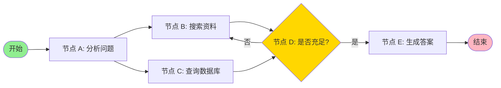
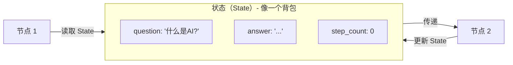
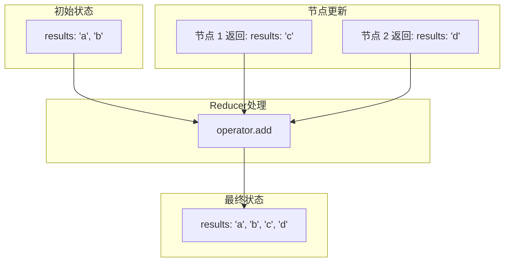
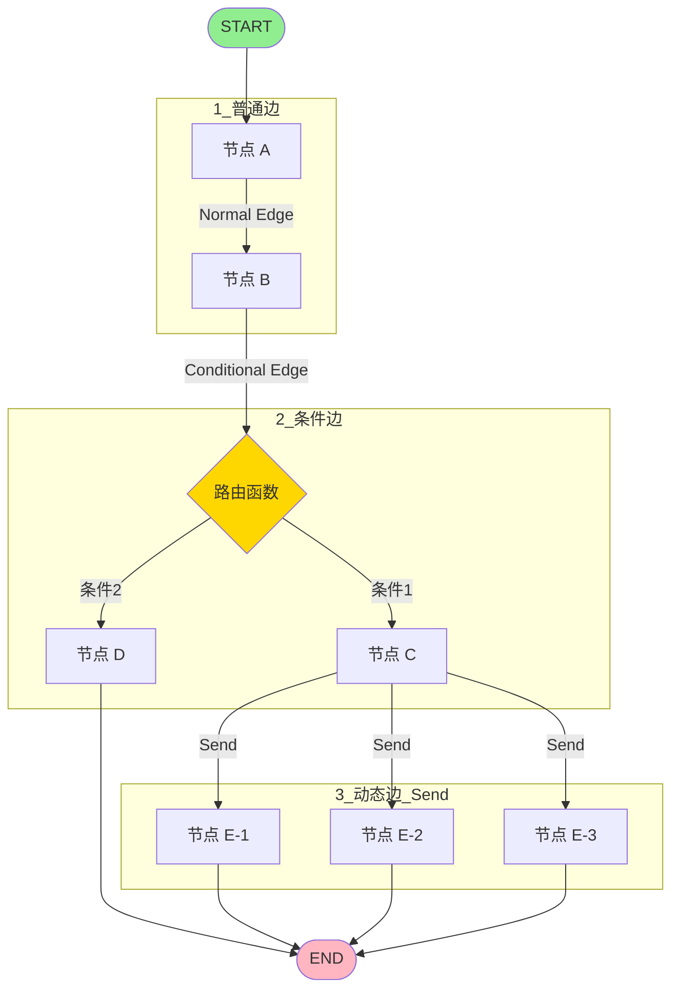
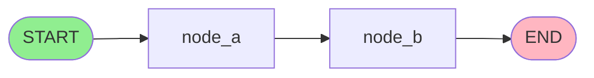
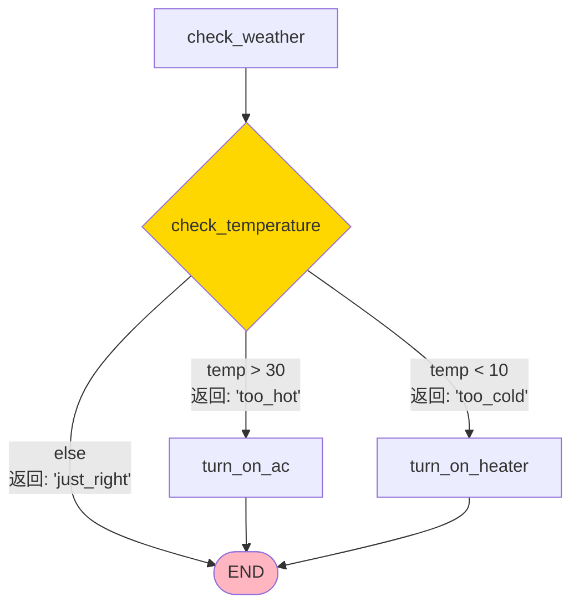
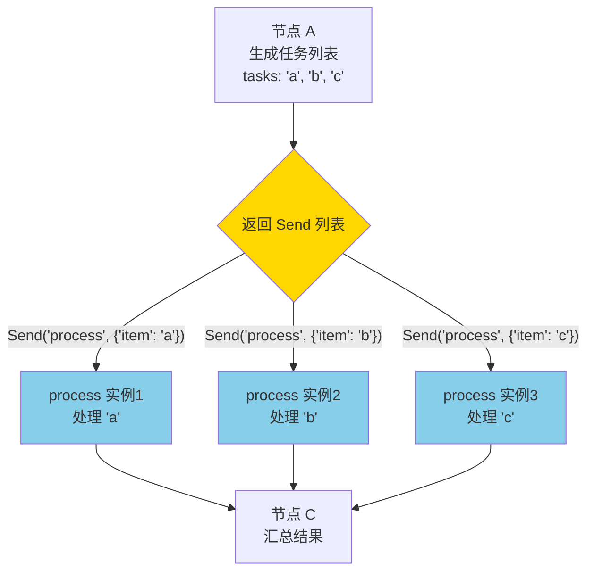
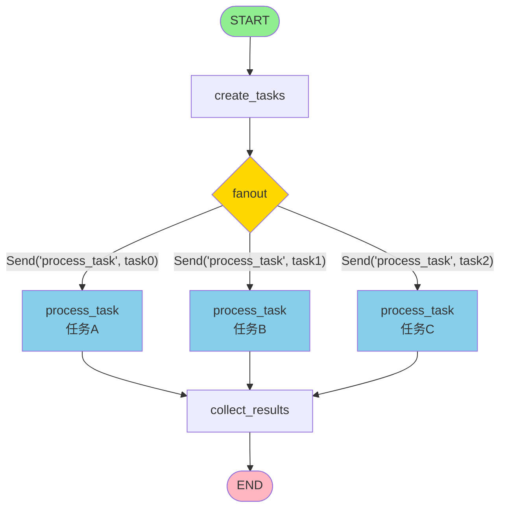
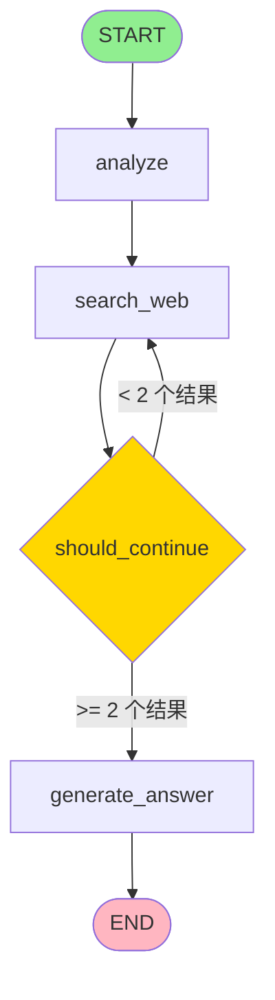

# **第一部分：LangGraph 基础概念**

---

# LangGraph

### 构建智能 Agent 的图工作流框架

*适用于复杂、多步骤的 AI 应用*

---

## **幻灯片 2: 为什么需要 LangGraph？**

### **传统 LLM 应用的局限性**

```python
# ❌ 传统方式：单次调用，无法迭代
response = llm.invoke("研究 2024 年 AI 最新进展")
print(response)  # 一次性返回，没有深度
```

**问题：**

- ✗ 无法进行多轮推理
- ✗ 无法根据结果决定下一步
- ✗ 无法并行处理多个任务
- ✗ 无法循环迭代改进

### **Agent 需要什么？**

- ✓ **循环**：反复执行直到满足条件
- ✓ **条件判断**：根据结果选择路径
- ✓ **并行处理**：同时执行多个任务
- ✓ **状态管理**：跨步骤保持信息

---

## **幻灯片 3: LangGraph 核心思想**

### **用图（Graph）建模工作流**



### **关键概念**

- **Nodes（节点）**：干活的
- **Edges（边）**：指路的
- **State（状态）**：记忆的

---

## **幻灯片 4: 概念 1 - State（状态）**

### **什么是 State？**

State 是在节点之间传递的**共享数据结构**，就像一个信息传递的"背包"。

### **定义方式：使用 TypedDict**

```python
from typing_extensions import TypedDict

class SimpleState(TypedDict):
    question: str          # 用户问题
    answer: str           # 最终答案
    step_count: int       # 执行步骤数

```

### **可视化理解**



---

## **幻灯片 5: State 的 Reducer（重要）**

### **问题：多个节点同时更新同一个 State Key 怎么办？**

**场景示例：** 三个搜索节点并行运行，都要更新 `results` 列表

### **解决方案：Reducer 函数**

```python
from typing import Annotated
from typing_extensions import TypedDict
import operator

class State(TypedDict):
    # 默认 reducer：覆盖
    question: str

    # 使用 operator.add：列表拼接
    results: Annotated[list[str], operator.add]

    # 自定义 reducer
    score: Annotated[int, lambda old, new: old + new]

```

### **Reducer 工作原理**



---

## **幻灯片 6: Reducer 实战示例**

### **例子 1：默认 Reducer（覆盖）**

```python
from typing_extensions import TypedDict

class State(TypedDict):
    name: str
    age: int

# 节点 1 返回
{"name": "Alice", "age": 25}

# 节点 2 返回
{"age": 26}

# 最终状态
{"name": "Alice", "age": 26}  # age 被覆盖

```

### **例子 2：使用 operator.add**

```python
from typing import Annotated
import operator

class State(TypedDict):
    messages: Annotated[list[str], operator.add]

# 初始状态
{"messages": ["Hi"]}

# 节点 1 返回
{"messages": ["Hello"]}

# 节点 2 返回
{"messages": ["How are you?"]}

# 最终状态
{"messages": ["Hi", "Hello", "How are you?"]}  # 拼接！

```

---

## **幻灯片 7: 特殊的 Reducer - add_messages**

### **处理聊天消息的专用 Reducer**

```python
from langgraph.graph import MessagesState
from langchain_core.messages import HumanMessage, AIMessage

# MessagesState 内置了 add_messages reducer
class State(MessagesState):
    # messages 已经定义好了
    pass

# 使用
state = {
    "messages": [
        HumanMessage(content="你好", id="1"),
        AIMessage(content="您好！", id="2")
    ]
}

# 更新已存在的消息（通过 id）
update = {"messages": [HumanMessage(content="你好，修改版", id="1")]}
# add_messages 会智能地更新 id="1" 的消息，而不是追加

```

### **add_messages 的智能之处**

- ✓ 新消息 → 追加到列表
- ✓ 已存在的消息（相同 ID）→ 更新内容
- ✓ 自动反序列化字典为 Message 对象

---

## **幻灯片 8: 概念 2 - Nodes（节点）**

### **节点就是 Python 函数**

```python
from typing_extensions import TypedDict

class State(TypedDict):
    input: str
    output: str

# 最简单的节点， 注意是在这里可以读取 state
def process_node(state: State) -> dict:
    """节点接收 state，返回 state 更新"""
    result = state["input"].upper()
    return {"output": result}

# 带配置的节点， 可以在运行时读取配置
from langchain_core.runnables import RunnableConfig

def advanced_node(state: State, config: RunnableConfig) -> dict:
    thread_id = config.get("configurable", {}).get("thread_id")
    print(f"在线程 {thread_id} 中运行")
    return {"output": "处理完成"}

```

### **节点的特点**

- 输入：`state`（必需）+ `config`（可选）
- 输出：字典，包含要更新的 state keys
- 可以是同步或异步函数

---

## **幻灯片 9: 节点示例 - 实际应用**

### **场景：天气查询 Agent**

```python
from typing_extensions import TypedDict

class WeatherState(TypedDict):
    city: str
    temperature: str
    status: str

def fetch_weather(state: WeatherState) -> dict:
    """节点：获取天气数据"""
    city = state["city"]

    # 模拟 API 调用
    temp = "25°C"

    return {
        "temperature": temp,
        "status": "已获取"
    }

def format_response(state: WeatherState) -> dict:
    """节点：格式化响应"""
    response = f"{state['city']}的温度是{state['temperature']}"
    return {"status": response}

```

---

## **幻灯片 10: 概念 3 - Edges（边）**

### **三种类型的边**



---

## **幻灯片 11: 边类型 1 - Normal Edge（普通边）**

### **固定的路径：A → B**

```python
from langgraph.graph import StateGraph, START, END

builder = StateGraph(State)

# 添加节点
builder.add_node("node_a", node_a_function)
builder.add_node("node_b", node_b_function)

# 添加边：固定流程
builder.add_edge(START, "node_a")      # 开始 → A
builder.add_edge("node_a", "node_b")   # A → B
builder.add_edge("node_b", END)        # B → 结束

graph = builder.compile()

```

### **流程图**



---

## **幻灯片 12: 边类型 2 - Conditional Edge（条件边）**

### **根据条件选择路径**

```python
from typing import Literal

class State(TypedDict):
    temperature: int
    action: str

def check_temperature(state: State) -> Literal["too_hot", "too_cold", "just_right"]:
    """路由函数：返回下一个节点的名称"""
    temp = state["temperature"]

    if temp > 30:
        return "too_hot"
    elif temp < 10:
        return "too_cold"
    else:
        return "just_right"

# 添加条件边
builder.add_conditional_edges(
    "check_weather",           # 从哪个节点出发
    check_temperature,         # 路由函数
    {                         # 可选：映射表
        "too_hot": "turn_on_ac",
        "too_cold": "turn_on_heater",
        "just_right": END
    }
)

```

---

## **幻灯片 13: 条件边可视化**



### **关键点**

- 路由函数的返回值 = 下一个节点的名称
- 可以返回节点名称字符串
- 可以使用映射表转换返回值

---

## **幻灯片 14: 边类型 3 - Send（动态并行边）** ⭐

### **为什么需要 Send？**

**问题场景：** 你事先不知道要处理多少个任务

```python
# ❌ 传统边：无法处理动态数量的任务
builder.add_edge("split_tasks", "process_task_1")  # 只能处理一个
builder.add_edge("split_tasks", "process_task_2")  # 写死的数量
# 如果有 100 个任务呢？不可能写 100 个节点！

# ✅ Send：动态创建任意数量的并行任务 （列表推导式语法）
def fanout(state):
    return [Send("process_task", task) for task in state["tasks"]]

```

---

## **幻灯片 14.1: Send 的核心思想**

### **一个函数 → 多个实例 → 并行执行**



**关键点：**

- 🎯 **同一个函数**（`process`），创建**多个实例**
- ⚡ **并行执行**，不是顺序执行
- 📦 每个实例有**独立的 state**

---

## **幻灯片 14.2: 实战例子 1 - 并行搜索**

### **场景：同时搜索多个关键词**

```python
from typing_extensions import TypedDict
from typing import Annotated
import operator
from langgraph.types import Send

class SearchState(TypedDict):
    query: str
    keywords: list[str]
    search_results: Annotated[list[dict], operator.add]

def generate_keywords(state: SearchState) -> dict:
    """第一步：从查询生成多个关键词"""
    query = state["query"]
    # 假设我们提取出 3 个关键词
    keywords = ["AI 应用", "机器学习", "神经网络"]
    return {"keywords": keywords}

def fanout_searches(state: SearchState) -> list[Send]:
    """第二步：为每个关键词创建搜索任务"""
    return [
        Send("search_keyword", {"keyword": kw, "id": idx})
        for idx, kw in enumerate(state["keywords"])
    ]

def search_keyword(state: dict) -> dict:
    """第三步：执行单个搜索（会并行运行多次）"""
    keyword = state["keyword"]
    search_id = state["id"]

    # 模拟搜索（假设我们在这里去调用 baidu、google 、知识库等知识来源接口）
    print(f"[搜索 {search_id}] 正在搜索: {keyword}")
    result = {
        "keyword": keyword,
        "snippet": f"{keyword} 的搜索结果...",
        "url": f"<https://example.com/{search_id}>"
    }

    return {"search_results": [result]}

def summarize_results(state: SearchState) -> dict:
    """第四步：汇总所有搜索结果"""
    total = len(state["search_results"])
    print(f"收集到 {total} 个搜索结果")
    return {}

```

---

## **幻灯片 14.3: 构建并行搜索图**

```python
from langgraph.graph import StateGraph, START, END

builder = StateGraph(SearchState)

# 添加节点
builder.add_node("generate_keywords", generate_keywords)
builder.add_node("search_keyword", search_keyword)  # 会被多次实例化
builder.add_node("summarize_results", summarize_results)

# 添加边
builder.add_edge(START, "generate_keywords")

# 🌟 关键：使用 conditional_edges + 返回 Send 列表
builder.add_conditional_edges(
    "generate_keywords",
    fanout_searches,  # 这个函数返回 Send 列表
    # 注意：不需要映射字典！
)

builder.add_edge("search_keyword", "summarize_results")
builder.add_edge("summarize_results", END)

graph = builder.compile()

```

---

## **幻灯片 14.4: 执行流程详解**

```python
# 执行
result = graph.invoke({
    "query": "深度学习基础",
    "keywords": [],
    "search_results": []
})

# 输出：
# [搜索 0] 正在搜索: AI 应用
# [搜索 1] 正在搜索: 机器学习      ← 并行！
# [搜索 2] 正在搜索: 神经网络
# 收集到 3 个搜索结果

print(len(result["search_results"]))  # 3

```

### **时间轴对比**

```
传统顺序执行：
├─ 搜索 1 (2秒) ──┐
                 ├─ 搜索 2 (2秒) ──┐
                                  ├─ 搜索 3 (2秒)
总时间：6 秒

Send 并行执行：
├─ 搜索 1 (2秒) ──┐
├─ 搜索 2 (2秒) ──┼─ 汇总
├─ 搜索 3 (2秒) ──┘
总时间：2 秒！⚡

```

---

## **幻灯片 14.5: Send 的两个参数详解**

```python
Send("目标节点名称", {"state": "数据"})
       ↑                ↑
     节点名            这个实例的 state

```

### **重要理解：每个 Send 创建独立的 state**

```python
def fanout(state: SearchState) -> list[Send]:
    return [
        Send("process", {"item": "A", "index": 0}),  # state 1
        Send("process", {"item": "B", "index": 1}),  # state 2
        Send("process", {"item": "C", "index": 2}),  # state 3
    ]

def process(state: dict) -> dict:
    # 这个函数会运行 3 次
    # 第一次：state = {"item": "A", "index": 0}
    # 第二次：state = {"item": "B", "index": 1}
    # 第三次：state = {"item": "C", "index": 2}
    print(f"处理 {state['item']}")
    return {"results": [f"完成 {state['item']}"]}

```

**🔑 关键：** 每个 Send 传递的 state 是**隔离的**，互不影响！

---

## **幻灯片 14.6: 完整可运行示例**



**流程说明：**

- START → create_tasks：创建任务列表。
- create_tasks → fanout：fanout 返回多个 Send，生成并行子流程。
- 每个 process_task 并行运行（任务A、B、C），最终合流到 collect_results 汇总。
- collect_results 结束后到 END。

```python
from typing_extensions import TypedDict
from typing import Annotated
import operator
from langgraph.graph import StateGraph, START, END
from langgraph.types import Send

class ParallelState(TypedDict):
    tasks: list[str]
    results: Annotated[list[str], operator.add]

def create_tasks(state: ParallelState) -> dict:
    """生成任务列表"""
    return {"tasks": ["任务A", "任务B", "任务C"]}

def fanout(state: ParallelState) -> list[Send]:
    """分发任务（返回 Send 列表）"""
    print(f"📤 分发 {len(state['tasks'])} 个任务")
    return [
        Send("process_task", {"task": task, "id": idx})
        for idx, task in enumerate(state["tasks"])
    ]

def process_task(state: dict) -> dict:
    """处理单个任务（并行执行）"""
    # ✨ 这里处理任务——这是“干活”的位置！你可以在这里执行每个任务的具体逻辑
    print(f"⚙️  [{state['id']}] 处理: {state['task']}")
    # 实际处理任务（此处为简单示例，实际可以替换为复杂业务代码）
    result = f"✅ 完成: {state['task']}"
    return {"results": [result]}

def collect_results(state: ParallelState) -> dict:
    """收集结果"""
    print(f"📥 收集到 {len(state['results'])} 个结果")
    for result in state["results"]:
        print(f"   {result}")
    return {}

# 构建图
builder = StateGraph(ParallelState)
builder.add_node("create_tasks", create_tasks)
builder.add_node("process_task", process_task)
builder.add_node("collect_results", collect_results)

builder.add_edge(START, "create_tasks")
builder.add_conditional_edges("create_tasks", fanout)
builder.add_edge("process_task", "collect_results")
builder.add_edge("collect_results", END)

graph = builder.compile()

# 运行
result = graph.invoke({"tasks": [], "results": []})

```

**输出：**

```
📤 分发 3 个任务
⚙️  [0] 处理: 任务A
⚙️  [1] 处理: 任务B
⚙️  [2] 处理: 任务C
📥 收集到 3 个结果
   ✅ 完成: 任务A
   ✅ 完成: 任务B
   ✅ 完成: 任务C

```

---

## **幻灯片 14.7: Send 核心要点总结**

### **记住这 5 点**

1. **🎯 用途**：运行时不知道要执行多少个任务
2. **⚡ 特性**：所有 Send 的任务并行执行
3. **📦 隔离**：每个任务有独立的 state
4. **🔗 合并**：必须用 Reducer 合并返回结果
5. **🔄 返回**：从条件边返回 `list[Send]`

### **语法模板**

```python
# 1. 定义 State（带 Reducer）
class State(TypedDict):
    results: Annotated[list, operator.add]

# 2. 创建 fanout 函数
def fanout(state: State) -> list[Send]:
    return [Send("node", {...}) for item in items]

# 3. 添加条件边
builder.add_conditional_edges("source", fanout)

```

---

## **幻灯片 15: 完整示例 - 简单的研究助手**

### **场景：回答问题前先搜索资料**

```python
from typing_extensions import TypedDict
from typing import Annotated
import operator
from langgraph.graph import StateGraph, START, END

class ResearchState(TypedDict):
    question: str
    search_results: Annotated[list[str], operator.add]
    answer: str

def analyze_question(state: ResearchState) -> dict:
    """分析问题"""
    print(f"分析问题: {state['question']}")
    return {}  # 不更新 state

def search_web(state: ResearchState) -> dict:
    """搜索网络
    这里可以调用外部 API 或第三方库，实现真正的联网搜索
    或调用知识库 API 获取信息
    比如调用 Google、Bing、Baidu 等实际搜索代码
    当前为演示，实际可替换下方 mock 逻辑
    """
    # TODO: 实际项目里这里可以联网搜索，比如
    # results = external_search(state["question"])
    results = [f"搜索结果1", f"搜索结果2"]
    return {"search_results": results}

def should_continue(state: ResearchState) -> str:
    """决定是否有足够信息"""
    if len(state.get("search_results", [])) >= 2:
        return "generate_answer"
    return "search_web"

def generate_answer(state: ResearchState) -> dict:
    """生成答案"""
    answer = f"基于{len(state['search_results'])}个来源的答案"
    return {"answer": answer}

```

---

## **幻灯片 16: 构建图**

```python
# 创建图
builder = StateGraph(ResearchState)

# 添加节点
builder.add_node("analyze", analyze_question)
builder.add_node("search_web", search_web)
builder.add_node("generate_answer", generate_answer)

# 添加边
builder.add_edge(START, "analyze")
builder.add_edge("analyze", "search_web")

# 添加条件边
builder.add_conditional_edges(
    "search_web",
    should_continue,
    {
        "search_web": "search_web",      # 循环
        "generate_answer": "generate_answer"
    }
)

builder.add_edge("generate_answer", END)

# 编译
graph = builder.compile()

```

---

## **幻灯片 17: 执行图**

```python
# 运行图
result = graph.invoke({
    "question": "LangGraph 是什么？",
    "search_results": [],
    "answer": ""
})

print(result)
# {
#     "question": "LangGraph 是什么？",
#     "search_results": ["搜索结果1", "搜索结果2"],
#     "answer": "基于2个来源的答案"
# }

```

### **流程图**



---

## **幻灯片 18: 编译图 - compile()**

### **为什么需要编译？**

```python
builder = StateGraph(State)
# ... 添加节点和边 ...

# ❌ 错误：未编译不能使用
# builder.invoke({"input": "test"})

# ✅ 正确：必须先编译
graph = builder.compile()
graph.invoke({"input": "test"})

```

### **编译做了什么？**

1. ✅ **结构检查**：确保没有孤立节点
2. ✅ **拓扑验证**：检查图的完整性
3. ✅ **配置注入**：添加 checkpointer、断点等
4. ✅ **优化执行**：准备运行时环境

---

## **幻灯片 19: 核心概念总结**

### **三大支柱**

| 组件 | 作用 | 类比 |
| --- | --- | --- |
| **State** | 数据容器 + Reducer | 📦 装着信息的 |
| **Nodes** | 执行逻辑 | 🏭 干活的 |
| **Edges** | 控制流程 | 🗺️ 指路的 |

### **特殊概念**

```python
# Reducer：如何合并状态更新，默认是覆盖，可以使用 operator.add 来拼接列表
Annotated[list, operator.add]

# Send：动态并行
Send("node_name", {"state": "value"})

# Conditional Edge：路由决策
add_conditional_edges("node", router_func)
```

---

## **幻灯片 20: 关键要点速记**

### **必须掌握的概念**

```python
# 1. State 定义
class State(TypedDict):
    data: Annotated[list, operator.add]  # Reducer!

# 2. 创建图
builder = StateGraph(State)

# 3. 添加节点
builder.add_node("name", function)

# 4. 添加边
builder.add_edge(START, "name")           # 普通边
builder.add_conditional_edges("name", func)  # 条件边
# 或返回 Send 列表                         # 动态边

# 5. 编译运行
graph = builder.compile()
result = graph.invoke({"data": []})

```

---

以上只是 LangGraph 的基础概念，更多高级特性请参考 LangGraph 官方文档。

## **幻灯片 21:  前端相关**

- LangGraph SDK、 useStream 等
- useStream 定义：
    - https://docs.langchain.com/oss/javascript/releases/langgraph-v1#custom-transports-in-usestream
    - [https://reference.langchain.com/javascript/interfaces/_langchain_langgraph-sdk.react.UseStream.html](https://reference.langchain.com/javascript/modules/_langchain_langgraph-sdk.react.html)
    - https://docs.langchain.com/langsmith/use-stream-react#event-handling

